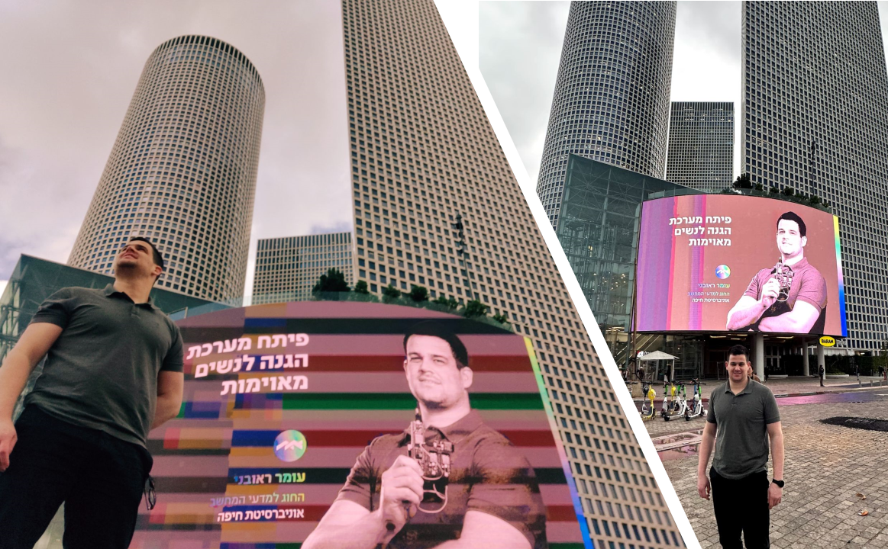
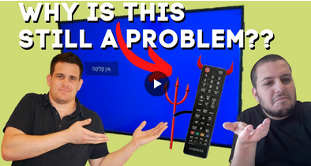

# Omer Re GitHub Portfolio

## 🔧 Technologies & Tools

  <!-- 'Sketch' logo used for creative communication -->
  <!-- Using 'Adobe' since it's related to digital media processing which can overlap with signal processing -->
  <!-- Continuing with 'Adobe' due to its strong association with image processing tools -->

## ⭐ Highlights

    <table>
        <tr>
            <td align="center">
                
            </td>
            <td align="center">
                
            </td>
            <td align="center">
                
            </td>
        </tr>
        <tr>
            <td colspan="3" align="center">
                <b>Lopo- IoT protection for threatened women</b>
            </td>
        </tr>
        <tr>
            <td align="center">
                <a href="https://www.linkedin.com/posts/omer-reuveni_%D7%A6%D7%99%D7%95%D7%A0%D7%99%D7%9D-%D7%96%D7%94-%D7%9C%D7%90-%D7%94%D7%9B%D7%9C-%D7%9B%D7%9B%D7%94-%D7%94%D7%97%D7%AA%D7%95%D7%9C-%D7%A9%D7%9C%D7%99-%D7%94%D7%9B%D7%A0%D7%99%D7%A1-%D7%9C%D7%9E%D7%95%D7%91%D7%99%D7%9C%D7%90%D7%99%D7%99-activity-7011214260835872768-8BdO?utm_source=share&utm_medium=member_desktop">
                    
                     
                    <b>My Story, on the "Entry Level" Podcast</b>
                </a>
            </td>
            <td align="center">
                <a href="https://www.linkedin.com/posts/omer-reuveni_computervision-careerintech-project-activity-6851411584040873984-WusW?utm_source=share&utm_medium=member_desktop">
                    
                     
                    <b>How My Cat Got Me a Job Interview?</b>
                </a>
            </td>
            <td align="center">
                <a href="https://www.linkedin.com/posts/omer-reuveni_%D7%9C%D7%9E%D7%94-%D7%9B%D7%93%D7%90%D7%99-%D7%9C%D7%9A-%D7%9C%D7%A2%D7%91%D7%95%D7%93-%D7%A2%D7%9C-%D7%A4%D7%A8%D7%95%D7%99%D7%A7%D7%98%D7%99%D7%9D-5-%D7%A1%D7%99%D7%91%D7%95%D7%AA-activity-6863835482632007681-QFn0?utm_source=share&utm_medium=member_desktop">
                    
                     
                    <b>Learning by doing, doing by need</b>
                </a>
            </td>
        </tr>
        <tr>
        <td align="center">
            <a href="https://www.linkedin.com/posts/omer-reuveni_%D7%A6%D7%99%D7%95%D7%A0%D7%99%D7%9D-%D7%96%D7%94-%D7%9C%D7%90-%D7%94%D7%9B%D7%9C-%D7%9B%D7%9B%D7%94-%D7%94%D7%97%D7%AA%D7%95%D7%9C-%D7%A9%D7%9C%D7%99-%D7%94%D7%9B%D7%A0%D7%99%D7%A1-%D7%9C%D7%9E%D7%95%D7%91%D7%99%D7%9C%D7%90%D7%99%D7%99-activity-7011214260835872768-8BdO?utm_source=share&utm_medium=member_desktop">
                
                 
                <b>SabaBox- Elderly-friendly remote</b>
            </a>
        </td>
        <td align="center" colspan="2">
            
            
             
            <b>SabaBox- Elderly-friendly remote</b>
        </td>
        </tr>
    </table>

## 🚀 Projects Portfolio

Project Name | Repository Link | Visibility | Demo | Technologies | Description
-------------------------------------- | --------------------------------------------------------------------------------------------------------------------------------- | ------------ | ------------------------------------------------------------------------------------------------------------------------------------------------------------------------------------------------------------------------------------------------------- | ------------------------------------------------------------------------------------------------------------------------------ | --------------------------------------------------------------------------------------------------
**Lopo** | [Repo](#) | 🔒 | [Go to demo](https://youtube.com/playlist?list=PLTBLOvkfAOMVFaATCREJi2Wmm2PMJ0PKX&si=DkV-duPGXDNGs8Um) | `C++`, `Cloud Computing`, `Impact`, `Sensing`, `Multi Device`, `Security`, `Communication`, `Signal Processing`, `Real-Time` | IoT protection for threatened women (Real-Time signal processing).
**Ad-Matay** | [Repo](https://github.com/omer-re/Ad-matay) | 👁 | [Go to demo](https://youtu.be/z0OymtZZark) | `OpenCV`, `Yolo`, `Raspberry Pi`, `Design pattern`, `Image Processing`, `Sensing`, `IoT`, `Computer Vision`, `Detection`, `Classification` | Monitors TV ads and provides alerts when specified ads are detected.
**Blob App** | [Repo](https://github.com/omer-re/blob_app) | 🔒 | [Go to demo](https://blobapp-23a38d25ba05.herokuapp.com/) | `Python`, `Streamlit`, `GUI`, `Web`, `Image Processing`, `Cloud Computing` | Blob me App is a web app offering easy interaction with computer vision capabilities.
**SabaBox** | [Repo](https://github.com/omer-re/Sababox) | 👁 | [Go to demo](https://www.linkedin.com/posts/omer-reuveni_accessibilityforall-accessibilitymatters-activity-6850465504985927680-tLmh?utm_source=share&utm_medium=member_desktop) | `C++`, `Sensors`, `Signal Processing`, `Impact`, `Hardware` | An award-winning project. Elderly-friendly remote that simplifies technology interaction.
**Pet Alert** | [Repo](https://github.com/omer-re/Pet_alert) | 👁 | [Go to demo](https://www.linkedin.com/posts/omer-reuveni_whats-easier-training-a-model-or-a-cat-activity-6700728580248219648-s108?utm_source=share&utm_medium=member_desktop) | `OpenCV`, `Image Processing`, `Sensing`, `IoT`, `Computer Vision`, `Detection`, `Classification` | Realtime alert system for naughty pets.
**OpenBot** | [Repo](https://github.com/isl-org/OpenBot/) | 👁 | [Follow me demo](https://youtu.be/gne7vPfbhWo?si=qEkW7NMfkoCYbolB)    [Object classification](https://www.linkedin.com/feed/update/urn:li:activity:6977136114146897920/?updateEntityUrn=urn%3Ali%3Afs_updateV2%3A%28urn%3Ali%3Aactivity%3A6977136114146897920%2CFEED_DETAIL%2CEMPTY%2CDEFAULT%2Cfalse%29&originTrackingId=PFcC6WONSbyMgjxBgzot%2Fw%3D%3D) | `Computer Vision`, `Detection`, `Tracking`, `Classification`, `Data`, `IoT`, `Sensing` | Computer vision car. Implementing OpenBot platform end-to-end in order to control mobile robots. The car can track and follow a person or an object. The platform allows experimenting with obascale detection, path planning and more using relatively cheap hardware.
**Picy** | [Repo](#) | 🔒 | [Go to demo](https://youtu.be/g_bKwUJ6X5Q?si=q6S1w3xJ6FWBLYJI) | `Python`, `OpenCV`, `Image Processing`, `Computer Vision` | Automated app for organizing scanned photo albums: color correction, person detection, and more.
**OpenCV Heatmap** | [Repo](https://github.com/omer-re/opencv_cat_heatmap) | 👁 | 🤷‍♂️ | `C++`, `OpenCV`, `Detection`, `Classification`, `Data`, `Sensing` | Tracks and visualizes my cats' favorite spots in the house with a heatmap.
**PDF Handler Web App** | [Repo](https://github.com/omer-re/pdf_handler_web_app) | 🔒 | launching soon| `Python`, `Streamlit`, `GUI`, `Web`, `Image Processing`, `Cloud Computing` | A web app for PDF management, including merging, splitting, and converting functions.
**Burner ID Generator** | [Repo](https://github.com/omer-re/burner_ID_Generator) | 🔒 | [Go to demo](https://www.linkedin.com/posts/omer-reuveni_adaadeacoacpacladg-acuacpacjacyabracgacpadfacp-activity-6947561029681766400-1Wye?utm_source=share&utm_medium=member_desktop) | `Python`, `Data`, `Encryption`, `Privacy`, `Impact` | Generator for temporary, secure IDs and credentials.
**Matam Traffic Dashboard** | [Repo](https://github.com/omer-re/map_dashboard_app) | 🔒 | launching soon | `Python`, `GIS`, `Cloud`, `Routing Algo`, `Google API`, `Impact` | Webpage dashboard displaying real-time traffic and transit data.
**Image Perspective Transform Demo** | [Repo](https://github.com/omer-re/imagePrespectiveTransform_demo) | 👁 | 🤷‍♂️ | `Python`, `Image Processing` | Demonstrates transformation matrix concepts through a fun, interactive application.
**Pan&Tilt Laser** | [C++ Repo](github.com/omer-re/AutoCatsLaserToy)  [Python Repo](https://github.com/omer-re/MicroPython_Pan_Tilt_Laser)   | 👁 | [Go to demo](https://www.linkedin.com/posts/omer-reuveni_%D7%95%D7%A2%D7%9B%D7%A9%D7%99%D7%95-%D7%91%D7%A8%D7%A6%D7%99%D7%A0%D7%95%D7%AA-%D7%9B%D7%99-%D7%90%D7%97%D7%A8%D7%99-%D7%94%D7%9B%D7%9C-%D7%9C%D7%99%D7%A0%D7%A7%D7%93%D7%90%D7%99%D7%9F-activity-6944883046542127104-sczc?utm_source=share&utm_medium=member_desktop) | `C++`, `MicroPython`, `IoT`, `ESP32`, `Multithreading`, `Servo`, `Laser` | Enhancing a Pan & Tilt laser system for pets using MicroPython and ESP32.
**Tzeva Adom Alert** | [Repo](https://github.com/omer-re/Tzeva_Adom_MicroPython_ESP32) | 👁 | [Go to demo](https://www.linkedin.com/posts/omer-reuveni_%D7%9E%D7%97%D7%A4%D7%A9%D7%99%D7%9D-%D7%A4%D7%A2%D7%99%D7%9C%D7%95%D7%AA-%D7%9E%D7%A9%D7%95%D7%AA%D7%A4%D7%AA-%D7%A2%D7%9D-%D7%94%D7%99%D7%9C%D7%93%D7%99%D7%9D-%D7%91%D7%94%D7%A9%D7%A8%D7%90%D7%AA-%D7%90%D7%99%D7%A8%D7%95%D7%A2%D7%99%D7%9D-activity-7185168339424473090-pU3K?utm_source=share&utm_medium=member_desktop) | `MicroPython`, `IoT`, `ESP32`, `Multithreading`, `Impact` | ESP32-based alert system providing critical updates in real-time.
**PDF Answers Hider** | [Repo](https://github.com/omer-re/PDF_Answers__Hider) | 👁 | [Go to demo](https://www.linkedin.com/feed/update/urn:li:activity:6632378612903477248/) | `Python`, `GUI`, `Web`, `Image Processing` | Helps students hide answers in PDFs for better study practices.
**PDF Indexer** | [Repo](https://github.com/omer-re/pdfIndexer_July23) | 🔒 | [Go to demo]() | `Python`, `Data`, `NLP` | Indexes large volumes of PDF documents for quick searching and retrieval.
**SiVi Bot** | [Repo](https://github.com/omer-re/Sivi_bot) | 🔒 | [Go to demo](https://t.me/SiVi_CV_bot) | `Python`, `Data`, `NLP`, `Chatbot`, `Impact` | A Telegram bot that provides social issue visibility and support.
**MeePo Bot** | [C++ Repo](https://github.com/omer-re/esp32_meepo/)  [Python Repo](https://github.com/omer-re/meepo_bot) | 🔒 | 🤷‍♂️ | `C++`, `Python`, `IoT`, `Sensors`, `Chatbot` | A home-monitoring Telegram bot reporting on room occupancy.
**Arduino 4DoF Robotic Arm** | [Repo](https://github.com/omer-re/arduino_robotic_arm) | 🔒 | [Go to demo](https://www.linkedin.com/posts/omer-reuveni_arduino-arduinoproject-maker-activity-6964469059841110016-WOVQ?utm_source=share&utm_medium=member_desktop) | `C++`, `Arduino`, `IoT`, `Hardware` | A 4DoF robotic arm demonstrating complex movements controlled via Arduino.
**NapFlix** | [Repo](https://github.com/omer-re/napflix) | 🔒 | [Go to demo](https://youtube.com/shorts/NPL6IZKH5Uc) | `OpenCV`, `Image Processing`, `Sensing`, `IoT`, `Computer Vision` | Detects when viewers fall asleep during movies and pauses playback.
**Whatsapp Group Parser** | [Repo](https://github.com/omer-re/whatsapp_group_parser) | 👁 | 🤷‍♂️ | `Python`, `Data`, `NLP` | Parses large WhatsApp group chats for data mining and analysis.
**Did I Lock Bot** | [Repo](https://github.com/omer-re/did_i_lock_bot) | 👁 | [Go to demo](https://www.linkedin.com/posts/omer-reuveni_ocd-quarantivity-covidabrandabrfun-activity-6714069139440324608-P6dV?utm_source=share&utm_medium=member_desktop) | `C++`, `ESP32`, `IoT`, `Chatbot`, `Sensors` | Monitors and controls door locks remotely, ensuring security and peace of mind.
**Gym Counter** | [Repo](https://github.com/omer-re/gym_counter) | 👁 | [Go to demo](https://www.linkedin.com/posts/omer-reuveni_makingabrtheabrbestabroutabrofabrtheabrsituation-activity-6645956496217780224-elrx?utm_source=share&utm_medium=member_desktop) | `OpenCV`, `Image Processing`, `Sensing`, `IoT` | Tracks gym exercises using computer vision to count reps and sets.
